# Formal Specification Tool Selection Guide

This guide helps you choose the right formal specification tools based on your use case, team expertise, project phase, and investment level.

## Quick Reference Table

| Tool | Best For | Learning Curve | Investment | Quick Win |
|------|----------|----------------|------------|-----------|
| **OpenAPI/Swagger** | REST APIs | Low | 1-2 weeks | ✓ |
| **AsyncAPI** | Event-driven systems | Low | 1-2 weeks | ✓ |
| **JSDoc/TSDoc** | JavaScript/TypeScript types | Low | 1 week | ✓ |
| **PropTypes** | React prop validation | Low | 1 week | ✓ |
| **Pydantic** | Python data validation | Low | 1-2 weeks | ✓ |
| **TLA+** | Concurrency, distributed systems | High | 2-3 months | ✗ |
| **Alloy** | Relational modeling, logic | Medium | 1-2 months | ✗ |
| **Prism** | Probabilistic systems | High | 2-3 months | ✗ |
| **SPARK Ada** | Safety-critical systems | Very High | 3-6 months | ✗ |
| **Coq/Isabelle** | Mathematical proofs | Very High | 6+ months | ✗ |
| **P** | Protocol verification | Medium | 1-2 months | ✗ |
| **Z notation** | Classic formal methods | High | 2-3 months | ✗ |

## Decision Tree

```mermaid
flowchart TD
    Start([Start: Selecting Spec Tool]) --> Q1{What is your PRIMARY use case?}

    Q1 -->|API Design| API[API Specification Branch]
    Q1 -->|Data Validation| DATA[Data Validation Branch]
    Q1 -->|Concurrency/Distributed| CONC[Concurrency Branch]
    Q1 -->|State Machines| STATE[State Machine Branch]
    Q1 -->|Safety-Critical| SAFETY[Safety-Critical Branch]
    Q1 -->|Mathematical Proofs| PROOF[Proof Branch]
    Q1 -->|Not Sure| QUICK[Quick Wins Branch]

    %% API Branch
    API --> APIType{What type of API?}
    APIType -->|REST/HTTP| REST[OpenAPI/Swagger]
    APIType -->|Events/Messaging| EVENTS[AsyncAPI]
    APIType -->|GraphQL| GRAPHQL[GraphQL Schema]
    APIType -->|gRPC| GRPC[Protocol Buffers]

    REST --> RESTRec{Team Expertise?}
    RESTRec -->|Web/JS| RESTJS[OpenAPI + Swagger UI]
    RESTRec -->|Java| RESTJava[OpenAPI + Springdoc]
    RESTRec -->|Python| RESTPy[OpenAPI + connexion]

    %% Data Validation Branch
    DATA --> DATAEnv{What Language?}
    DATAEnv -->|TypeScript| TS[TSDoc + TypeScript]
    DATAEnv -->|JavaScript| JS[JSDoc + PropTypes]
    DATAEnv -->|Python| PY[Pydantic + mypy]
    DATAEnv -->|Rust| RUST[Serde + Schemars]
    DATAEnv -->|Go| GO[Go structs + go-vet]

    %% Concurrency Branch
    CONC --> CONCExp{Team Expertise?}
    CONCExp -->|Distributed Systems| DIST[TLA+]
    CONCExp -->|Systems Programming| SYS[TLA+ or P]
    CONCExp -->|Functional Programming| FP[Alloy or TLA+]

    DIST --> DISTTime{Investment Level?}
    DISTTime -->|1-2 weeks| DISTQuick[Pseudocode + Property-based tests]
    DISTTime -->|1-2 months| DISTMed[TLA+ basic models]
    DISTTime -->|3+ months| DISTDeep[TLA+ + PlusCal]

    %% State Machine Branch
    STATE --> STATEType{What Type?}
    STATEType -->|Protocol| PROTO[P or TLA+]
    STATEType -->|UI/Workflow| UI[Statecharts/XState]
    STATEType -->|Business Logic| BL[State machines in code]

    UI --> UIFrame{Framework?}
    UIFrame -->|React/JS| UIXState[XState]
    UIFrame -->|Other| UIState[Statecharts library]

    %% Safety-Critical Branch
    SAFETY --> SAFETYStd{Standard Required?}
    SAFETYStd -->|DO-178C| DO178[SPARK Ada]
    SAFETYStd -->|ISO 26262| ISO[Z notation or SPARK]
    SAFETYStd -->|IEC 61508| IEC[SPARK or Z]

    DO178 --> SPARK[SPARK Ada + GNATprove]
    ISO --> Z[Z notation or Alloy]

    %% Proof Branch
    PROOF --> PROOFType{What Kind of Proof?}
    PROOFType -->|Program Correctness| CORRECT[Coq or Isabelle]
    PROOFType -->|Mathematical Theorem| MATH[Coq or Lean]
    PROOFType -->|Cryptographic| CRYPTO[Coq or F*]

    %% Quick Wins Branch
    QUICK --> QUICKPhase{Project Phase?}
    QUICKPhase -->|Design| DESIGN[OpenAPI or AsyncAPI]
    QUICKPhase -->|Implementation| IMP[Type systems + Property tests]
    QUICKPhase -->|Testing| TEST[property-based testing]
    QUICKPhase -->|Maintenance| MAINT[Documentation + Tests]

    IMP --> IMPLang{Language?}
    IMPLang -->|Python| IMPpy[Hypothesis + Pydantic]
    IMPLang -->|JS/TS| IMPjs[Zod + fast-check]
    IMPLang -->|Java| IMPjava[JUnit-Quickcheck]
    IMPLang -->|Haskell| IMPhask[QuickCheck built-in]
```



## ASCII Decision Tree

```
START
  |
  v
What is your PRIMARY use case?
  |
  +-- API Design
  |    |
  |    +-- REST/HTTP? --> OpenAPI/Swagger
  |    +-- Events/Messaging? --> AsyncAPI
  |    +-- GraphQL? --> GraphQL Schema
  |    +-- gRPC? --> Protocol Buffers
  |
  +-- Data Validation
  |    |
  |    +-- TypeScript? --> TSDoc + TypeScript
  |    +-- JavaScript? --> JSDoc + PropTypes
  |    +-- Python? --> Pydantic + mypy
  |    +-- Rust? --> Serde + Schemars
  |    +-- Go? --> Go structs + go-vet
  |
  +-- Concurrency/Distributed Systems
  |    |
  |    +-- 1-2 weeks? --> Pseudocode + Property-based tests
  |    +-- 1-2 months? --> TLA+ basic models
  |    +-- 3+ months? --> TLA+ + PlusCal
  |
  +-- State Machines
  |    |
  |    +-- UI/Workflow? --> XState / Statecharts
  |    +-- Protocol? --> P or TLA+
  |    +-- Business Logic? --> State machine library
  |
  +-- Safety-Critical
  |    |
  |    +-- DO-178C? --> SPARK Ada
  |    +-- ISO 26262? --> Z notation or Alloy
  |    +-- IEC 61508? --> SPARK or Z
  |
  +-- Mathematical Proofs
  |    |
  |    +-- Program Correctness? --> Coq or Isabelle
  |    +-- Mathematical Theorem? --> Coq or Lean
  |    +-- Cryptographic? --> Coq or F*
  |
  +-- Not Sure / Quick Wins
       |
       +-- Design Phase? --> OpenAPI or AsyncAPI
       +-- Implementation? --> Type systems + Property tests
       +-- Testing? --> property-based testing
       +-- Maintenance? --> Documentation + Tests
```

## Detailed Recommendations by Use Case

### 1. API Design & Documentation

#### **Recommended: OpenAPI/Swagger (REST)**

**Best for:**
- REST/HTTP API design
- API documentation
- Contract testing
- Code generation

**When to choose:**
- Team works with web technologies
- Need clear API contracts between teams
- Want automatic documentation generation
- Need client/server code generation

**Investment timeline:**
- **Week 1:** Learn OpenAPI specification, create basic spec
- **Week 2:** Set up Swagger UI, integrate with CI/CD

**Quick Win Path:**
- Start with existing API documentation
- Convert to OpenAPI YAML format
- Use Swagger UI for visualization
- Add validation gradually

**Strategic Investment Path:**
- Design-first approach (spec before code)
- Generate server stubs and client SDKs
- Implement contract testing
- Version management and governance

**Learning Resources:**
- [OpenAPI Specification](https://spec.openapis.org/oas/latest.html)
- [Swagger UI Tutorial](https://swagger.io/tools/swagger-ui/)
- [OpenAPI Generator](https://openapi-generator.tech/docs/installation)

---

#### **Recommended: AsyncAPI (Event-Driven)**

**Best for:**
- Event-driven architectures
- Message queues (Kafka, RabbitMQ, etc.)
- Async APIs and webhooks
- Microservices communication

**When to choose:**
- Building event-driven systems
- Using message brokers
- Need async API documentation
- Want to document event flows

**Investment timeline:**
- **Week 1:** Learn AsyncAPI spec, document basic events
- **Week 2:** Set up AsyncAPI Studio, generate documentation

**Learning Resources:**
- [AsyncAPI Specification](https://www.asyncapi.com/docs/specifications/latest)
- [AsyncAPI Tutorial](https://www.asyncapi.com/docs/tutorials)

---

### 2. Data Validation & Type Safety

#### **Recommended: Pydantic (Python)**

**Best for:**
- Python API development
- Data validation and serialization
- Configuration management
- FastAPI integration

**When to choose:**
- Team uses Python
- Need runtime type checking
- Building APIs (especially FastAPI)
- Want data validation without heavy framework

**Investment timeline:**
- **Week 1:** Define Pydantic models, basic validation
- **Week 2:** Advanced validation, custom validators, mypy integration

**Quick Win Path:**
- Add Pydantic to existing project
- Define models for API inputs/outputs
- Use `BaseModel` for configuration
- Add type hints gradually

**Strategic Investment Path:**
- Comprehensive model layer
- Custom validators for business logic
- Full mypy coverage
- JSON schema generation

**Learning Resources:**
- [Pydantic Documentation](https://docs.pydantic.dev/)
- [FastAPI Tutorial](https://fastapi.tiangolo.com/tutorial/)

---

#### **Recommended: TypeScript + TSDoc**

**Best for:**
- JavaScript/TypeScript projects
- Type safety at compile time
- IDE autocomplete
- Self-documenting code

**When to choose:**
- Team uses JavaScript/TypeScript
- Want better developer experience
- Need catch errors before runtime
- Building large-scale applications

**Investment timeline:**
- **Week 1:** Add TypeScript to project, define basic types
- **Week 2:** Advanced types, generics, utility types

**Learning Resources:**
- [TypeScript Handbook](https://www.typescriptlang.org/docs/handbook/intro.html)
- [TSDoc Documentation](https://tsdoc.org/)

---

#### **Recommended: Zod (TypeScript/JavaScript)**

**Best for:**
- Runtime type validation
- Schema validation
- Type inference from schemas
- Form validation

**When to choose:**
- Need both compile-time and runtime validation
- Parsing untrusted data
- Building forms or APIs
- Want type-safe schemas

**Investment timeline:**
- **Week 1:** Define Zod schemas, basic validation
- **Week 2:** Advanced schemas, error handling, integration

**Learning Resources:**
- [Zod Documentation](https://zod.dev/)

---

### 3. Concurrency & Distributed Systems

#### **Recommended: TLA+**

**Best for:**
- Distributed algorithms
- Concurrent systems
- Consistency protocols
- Finding subtle bugs

**When to choose:**
- Building distributed systems
- Need to verify concurrency properties
- Can invest 2-3 months learning
- Want to catch hard-to-find bugs

**Investment timeline:**
- **Month 1:** Learn TLA+ basics, specify simple algorithms
- **Month 2:** Model your system, verify invariants
- **Month 3:** Advanced modeling, PlusCal, performance optimization

**Quick Win Path:**
- Start with pseudocode specs
- Use property-based testing instead
- Document invariants in code

**Strategic Investment Path:**
- Learn TLA+ fundamentals
- Model critical components
- Verify with TLC model checker
- Integrate into design review process

**Learning Resources:**
- [Learn TLA+](https://learntla.com/)
- [TLA+ Video Course](https://www.youtube.com/playlist?list=PLWAIpDJ73C07hVObz8JGnGN2DZZq7hkGn)
- [Specifying Systems](https://lamport.azurewebsites.net/tla/book.html) - Free book by Leslie Lamport

**Warning:** TLA+ has a steep learning curve. Start with small models and be patient.

---

#### **Recommended: P Language**

**Best for:**
- Protocol verification
- Event-driven systems
- Asynchronous communication
- State machine heavy systems

**When to choose:**
- Verifying communication protocols
- Building event-driven systems
- Team has systems programming background
- Need to verify state machines

**Investment timeline:**
- **Month 1:** Learn P language basics
- **Month 2:** Model protocols, verify properties

**Learning Resources:**
- [P Language](https://p-org.github.io/P/)

---

### 4. State Machines & Workflows

#### **Recommended: XState (JavaScript/TypeScript)**

**Best for:**
- React/Vue/JavaScript applications
- UI state management
- Workflow orchestration
- Complex user interactions

**When to choose:**
- Building complex UIs
- Need predictable state management
- Want visual state diagrams
- Team uses JavaScript/TypeScript

**Investment timeline:**
- **Week 1:** Learn XState basics, model simple flows
- **Week 2:** Advanced features, guards, services, integration

**Quick Win Path:**
- Model one critical user flow
- Add XState to existing codebase
- Use visualizer for documentation

**Strategic Investment Path:**
- Comprehensive state architecture
- State machine testing
- Visual documentation
- Team training and best practices

**Learning Resources:**
- [XState Documentation](https://xstate.js.org/docs/)
- [Statecharts in React](https://statecharts.github.io/)

---

### 5. Safety-Critical Systems

#### **Recommended: SPARK Ada**

**Best for:**
- Avionics (DO-178C)
- Medical devices
- Railway systems
- High-assurance systems

**When to choose:**
- Building safety-critical software
- Need formal verification
- Regulatory compliance required
- Can invest 6+ months

**Investment timeline:**
- **Month 1-2:** Learn Ada and SPARK basics
- **Month 3-4:** SPARK proofs, verification
- **Month 5-6:** Advanced features, optimization

**Learning Resources:**
- [SPARK User's Guide](https://docs.adacore.com/spark2014-arm/html/ug/ug.html)
- [SPARK for the Masses](https://www.adacore.com/sparkpro)

---

#### **Recommended: Z Notation**

**Best for:**
- Classic formal methods
- Database schema design
- Security protocols
- Academic/industrial research

**When to choose:**
- Need mathematically precise specs
- Building critical systems
- Team has math background
- Industry requires formal methods

**Investment timeline:**
- **Month 1-2:** Learn Z notation basics
- **Month 3:** Apply to real problems

**Learning Resources:**
- [Z Notation](https://www.cs.cmu.edu/~15819/lectures/01-intro.pdf)
- [Using Z: Specification, Refinement, and Proof](https://www.amazon.com/Using-Specification-Refinement-Proof-Prentice/dp/0139484728)

---

### 6. Mathematical Proofs & Program Verification

#### **Recommended: Coq**

**Best for:**
- Mathematical theorem proving
- Program verification
- Compiler verification
- Cryptographic proofs

**When to choose:**
- Need mathematical correctness proofs
- Building verified compilers/interpreters
- Academic research
- Can invest 6+ months

**Investment timeline:**
- **Month 1-3:** Learn Coq basics, tactics
- **Month 4-6:** Advanced tactics, proofs
- **Month 7+:** Real-world applications

**Learning Resources:**
- [Software Foundations](https://softwarefoundations.cis.upenn.edu/) - Free online book
- [Coq Art](https://www.amazon.com/Interactive-Theorem-Proving-Engineering-Scientific/dp/0198529589)

---

#### **Recommended: Isabelle/HOL**

**Best for:**
- Higher-order logic proofs
- Program verification
- Mathematical proofs
- Academic research

**When to choose:**
- Need higher-order logic
- Proving complex properties
- Academic/industrial research

**Learning Resources:**
- [Isabelle Documentation](https://isabelle.in.tum.de/documentation.html)

---

## Investment Level Guide

### 1-Week Quick Wins

**Tools:**
- OpenAPI/Swagger for API documentation
- JSDoc/TSDoc for JavaScript/TypeScript
- Pydantic for Python data validation
- PropTypes for React components
- Property-based testing frameworks

**Strategy:**
- Start with documentation
- Add validation layers
- Use existing type systems
- Gradual adoption

**When to choose:**
- Need immediate improvements
- Limited time for learning
- Want to demonstrate value
- Building non-critical systems

---

### 1-2 Month Strategic Investments

**Tools:**
- TLA+ basic models for concurrency
- XState for state management
- P for protocol verification
- Alloy for relational modeling

**Strategy:**
- Focus on critical components
- Small-scale adoption
- Prove value gradually
- Build team expertise

**When to choose:**
- Building distributed systems
- Need better state management
- Can allocate dedicated learning time
- Want to improve system design

---

### 3-6 Month Deep Investments

**Tools:**
- TLA+ advanced modeling
- SPARK Ada for safety-critical systems
- Coq/Isabelle for proofs
- Z notation for formal specification

**Strategy:**
- Formal training program
- Dedicated specialists
- Process integration
- Long-term adoption plan

**When to choose:**
- Safety-critical requirements
- Regulatory compliance
- High-value systems
- Long-term project horizon

---

## Team Expertise Guide

### Functional Programming Background

**Recommended Tools:**
- **TLA+** - Mathematical thinking maps well to FP
- **Alloy** - Declarative specification
- **Haskell + QuickCheck** - Property-based testing
- **Coq** - Proof assistant, very functional

**Why:** Functional programmers are already familiar with:
- Mathematical thinking
- Immutable state
- Formal properties
- Type systems

---

### Object-Oriented Background

**Recommended Tools:**
- **OpenAPI/Swagger** - Object-oriented modeling
- **Statecharts/XState** - Visual state modeling
- **UML + OCL** - Familiar notation
- **Design by Contract** (Eiffel, JML)

**Why:** OO developers are familiar with:
- Class modeling
- State diagrams
- Contracts and invariants
- Visual modeling

---

### Systems Programming Background

**Recommended Tools:**
- **TLA+** - Low-level thinking
- **P Language** - Protocol verification
- **SPARK Ada** - Systems verification
- **Alloy** - Lightweight formal methods

**Why:** Systems programmers understand:
- Concurrency challenges
- Memory models
- Low-level invariants
- Performance trade-offs

---

### Web Development Background

**Recommended Tools:**
- **OpenAPI/Swagger** - API design
- **AsyncAPI** - Event-driven APIs
- **TypeScript** - Type safety
- **XState** - UI state management
- **Zod/Joi** - Schema validation

**Why:** Web developers can leverage:
- JavaScript/TypeScript knowledge
- API design experience
- UI/UX thinking
- Rapid iteration

---

## Project Phase Guide

### Design Phase

**Focus:** Architecture, protocols, contracts

**Recommended:**
- **OpenAPI/AsyncAPI** - API contracts
- **TLA+** - Algorithm design
- **Statecharts** - User flow design
- **Alloy** - Data model design

**Goals:**
- Validate design decisions
- Find issues early
- Communicate architecture
- Generate documentation

---

### Implementation Phase

**Focus:** Correctness, validation, types

**Recommended:**
- **TypeScript/Pydantic** - Type safety
- **Property-based testing** - Invariant testing
- **XState** - State management
- **Design by Contract** - Pre/postconditions

**Goals:**
- Catch bugs early
- Ensure correctness
- Maintain invariants
- Document assumptions

---

### Testing Phase

**Focus:** Verification, property checking

**Recommended:**
- **QuickCheck/Hypothesis** - Property testing
- **TLA+** - Model checking
- **Alloy** - Instance finding
- **Fuzzing** - Edge case testing

**Goals:**
- Verify properties
- Find edge cases
- Ensure coverage
- Validate assumptions

---

### Maintenance Phase

**Focus:** Documentation, regression prevention

**Recommended:**
- **OpenAPI/Swagger** - Living documentation
- **Type systems** - Prevent regressions
- **Property tests** - Verify behavior
- **State machines** - Document behavior

**Goals:**
- Maintain documentation
- Prevent regressions
- Onboard new developers
- Ensure consistency

---

## Quick Win vs Strategic Investment

### Quick Wins (Do This Week)

1. **Add OpenAPI spec for existing API**
   - Document one endpoint
   - Generate Swagger UI
   - Value: Immediate documentation

2. **Add TypeScript to JavaScript project**
   - Add to one file
   - Define basic types
   - Value: Catch bugs early

3. **Add Pydantic models**
   - Model one API endpoint
   - Validate inputs
   - Value: Runtime validation

4. **Add property-based test**
   - Test one function
   - Find edge cases
   - Value: Better coverage

5. **Document state machine**
   - Draw state diagram
   - Document transitions
   - Value: Clearer logic

---

### Strategic Investments (Plan This Quarter)

1. **Adopt TLA+ for distributed systems**
   - Train team members
   - Model critical components
   - Value: Prevent critical bugs

2. **Implement XState architecture**
   - Redesign state management
   - Test state machines
   - Value: Predictable behavior

3. **Formal verification with SPARK**
   - Hire/train specialists
   - Verify critical modules
   - Value: Safety compliance

4. **Proof assistant adoption**
   - Long-term training
   - Research prototypes
   - Value: Mathematical certainty

---

## Getting Started Checklist

### Before Choosing a Tool

- [ ] Identify primary use case (API, concurrency, state, etc.)
- [ ] Assess team expertise and willingness to learn
- [ ] Determine investment level (1 week vs 3 months)
- [ ] Consider project phase (design, implementation, testing)
- [ ] Check regulatory requirements (safety-critical?)
- [ ] Evaluate existing tools and processes

### For Quick Wins (1-2 weeks)

- [ ] Choose tool based on language/stack
- [ ] Start with one component/endpoint
- [ ] Document learnings
- [ ] Measure impact (bugs caught, etc.)
- [ ] Decide on broader adoption

### For Strategic Investments (2-6 months)

- [ ] Get management buy-in
- [ ] Allocate dedicated learning time
- [ ] Start with training program
- [ ] Pilot on non-critical component
- [ ] Measure and communicate value
- [ ] Plan long-term adoption

---

## Common Pitfalls to Avoid

### 1. Over-Engineering

**Don't use heavy tools when:**
- Building simple CRUD apps
- Team lacks expertise
- Timeline is tight
- Requirements are changing

**Better alternatives:**
- Type systems
- Property testing
- Good documentation

### 2. Skipping the Basics

**Before TLA+, make sure you:**
- Write clear pseudocode
- Document invariants
- Use property testing
- Have good tests

### 3. Team Mismatch

**Don't choose:**
- Coq for a web team (unless they want to learn)
- SPARK for a Python team
- Heavy tools for quick prototypes

### 4. Poor Integration

**Avoid:**
- Separate specification from code
- Not updating specs
- Specs only in academia
- No tooling/automation

---

## Success Stories

### Quick Win Success: API Documentation

**Company:** E-commerce startup
**Tool:** OpenAPI + Swagger UI
**Investment:** 1 week
**Result:**
- 50% reduction in API questions
- Better frontend/backend collaboration
- Auto-generated client SDKs

### Strategic Investment Success: Distributed Systems

**Company:** Cloud infrastructure provider
**Tool:** TLA+
**Investment:** 3 months
**Result:**
- Found 3 critical distributed system bugs
- Improved team's understanding of concurrency
- Better system design reviews

### Long-term Investment Success: Safety-Critical

**Company:** Aviation software company
**Tool:** SPARK Ada
**Investment:** 12 months
**Result:**
- DO-178C certification
- Zero critical bugs in production
- Competitive advantage in market

---

## Additional Resources

### Learning Platforms

- [Learn TLA+](https://learntla.com/) - Free TLA+ tutorial
- [Software Foundations](https://softwarefoundations.cis.upenn.edu/) - Coq book
- [Formal Methods Wiki](https://en.wikipedia.org/wiki/Formal_methods) - Overview

### Communities

- [TLA+ Google Group](https://groups.google.com/g/tlaplus)
- [Coq Discourse](https://coq.discourse.group/)
- [XState Discord](https://discord.gg/xstate)

### Tools and Libraries

- [OpenAPI Tools](https://openapi-generator.tech/)
- [Awesome Formal Methods](https://github.com/JosephZoeller/MAJE-Formal-Methods-Resources)
- [Property Testing Libraries](https://hypothesis.readthedocs.io/)

---

## Decision Framework Summary

Use this framework when choosing a tool:

```
1. WHAT is your primary use case?
   ↓
2. WHO is your team and what do they know?
   ↓
3. WHEN do you need results (timeline)?
   ↓
4. HOW much can you invest (time/money)?
   ↓
5. WHY are you doing this (goals/requirements)?
   ↓
6. SELECT the appropriate tool
   ↓
7. START small and iterate
```

Remember: The best tool is the one you'll actually use. Start small, demonstrate value, and expand from there.
